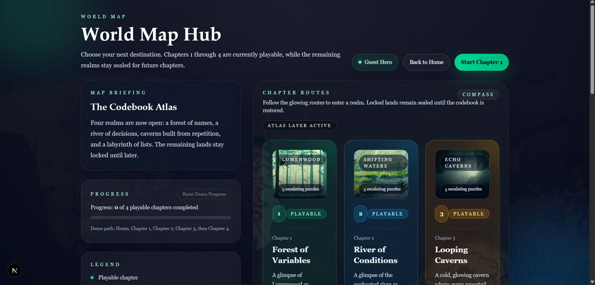
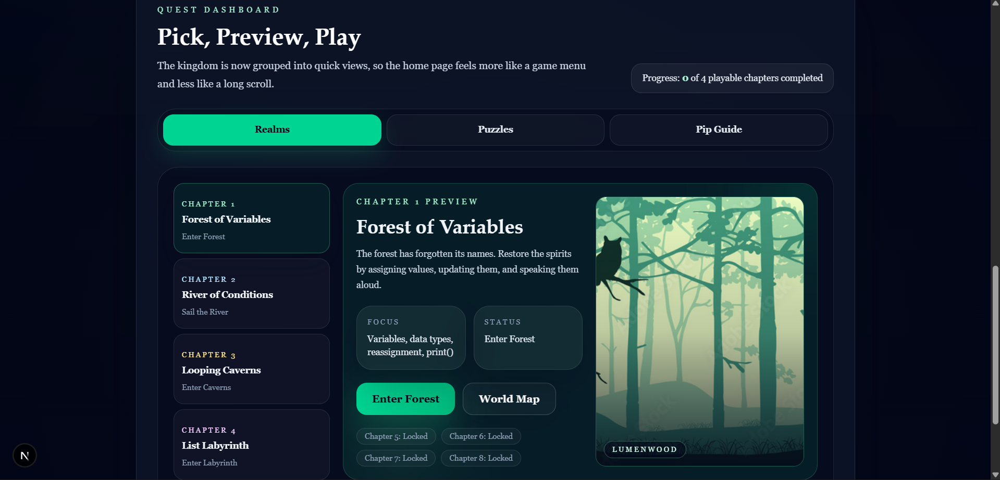
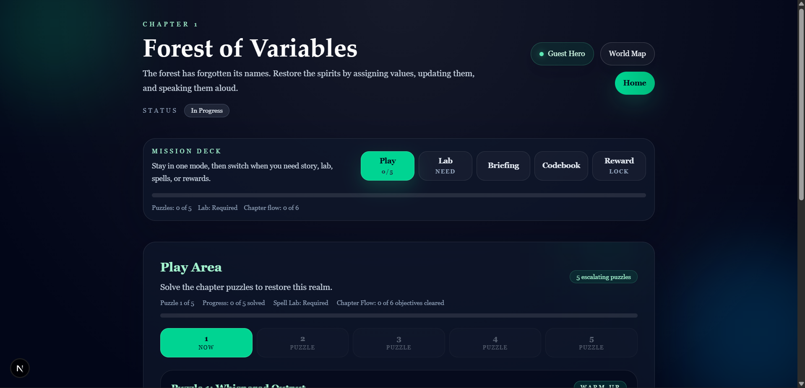
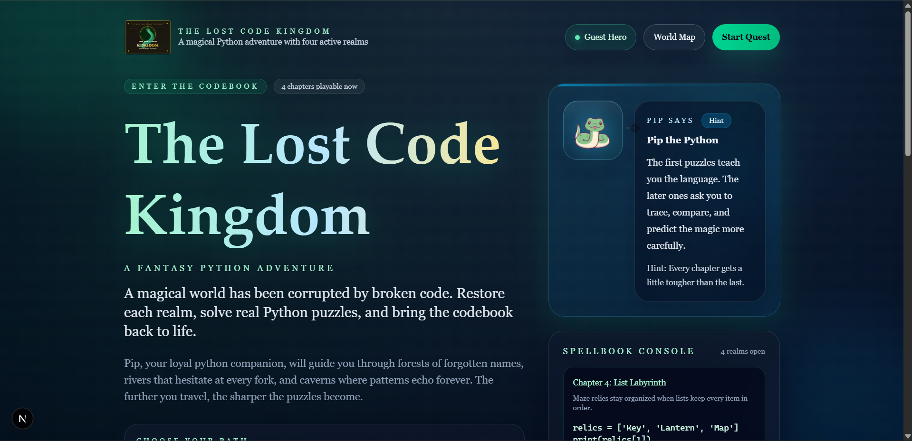
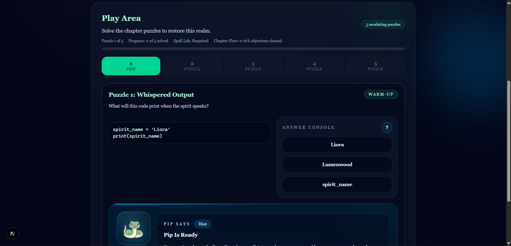
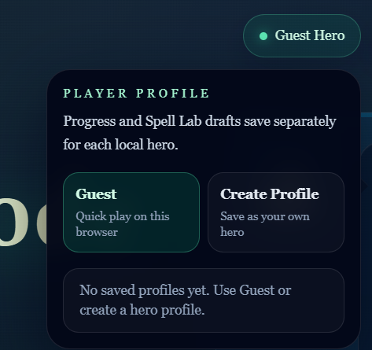

# The Lost Code Kingdom

A dark fantasy, browser-based Python learning adventure built with Next.js. Players restore broken realms by solving small interactive coding puzzles, using Python logic to unlock each chapter and recover the kingdom’s lost codebook.



## Overview

The Lost Code Kingdom turns Python practice into a magical quest. Each chapter introduces a new concept—variables, conditions, loops, and lists—through story-driven puzzle play, concise hints, and a Spell Lab that encourages experimentation.

### Core gameplay loop

- Explore the kingdom through a world map and chapter preview screens
- Solve a sequence of Python challenges in each realm
- Use a guided Spell Lab to test and refine code
- Advance through story and unlock new areas of the map

## Features

- Four playable chapters with chapter-specific puzzle flows
- Interactive Python playground built for in-browser experimentation
- Progress tracking with local persistence
- Story-rich realm pages and fantasy UI treatment
- Responsive dark mode adventure layout for desktop and tablet play

## Screenshots

### Landing experience


### Quest dashboard



### In-game play area



### Chapter page



### World map hub



### Extra shot



## Tech stack

- Next.js
- React
- JavaScript
- CSS and custom UI styling
- Browser-based Python logic flow for chapter puzzles

## Getting started

Install dependencies:

```bash
npm install
```

Run the app locally:

```bash
npm run dev
```

Open http://localhost:3000 to play.

## Project structure

```text
src/
  app/
    page.js                 # Home / quest dashboard
    chapters/
      page.js               # World map
      forest-of-variables/
      river-of-conditions/
      looping-caverns/
      list-labyrinth/
  components/
    ChapterAdventurePage.js
    PythonPlayground.js
    AccountPanel.js
    PipDialogue.js
  lib/
    chapterConfigs.js
    gameUi.js
    spellLabStorage.js
    pyodideRuntime.js
public/
  art/
    forest-of-variables-scene.svg
    river-of-conditions-scene.svg
    looping-caverns-scene.svg
    list-labyrinth-scene.svg
```

## Notes

This project is designed as a teaching-focused adventure and is intentionally lightweight: the chapter data, puzzle states, and local progression are all managed in the browser so it can be run and demoed quickly.
